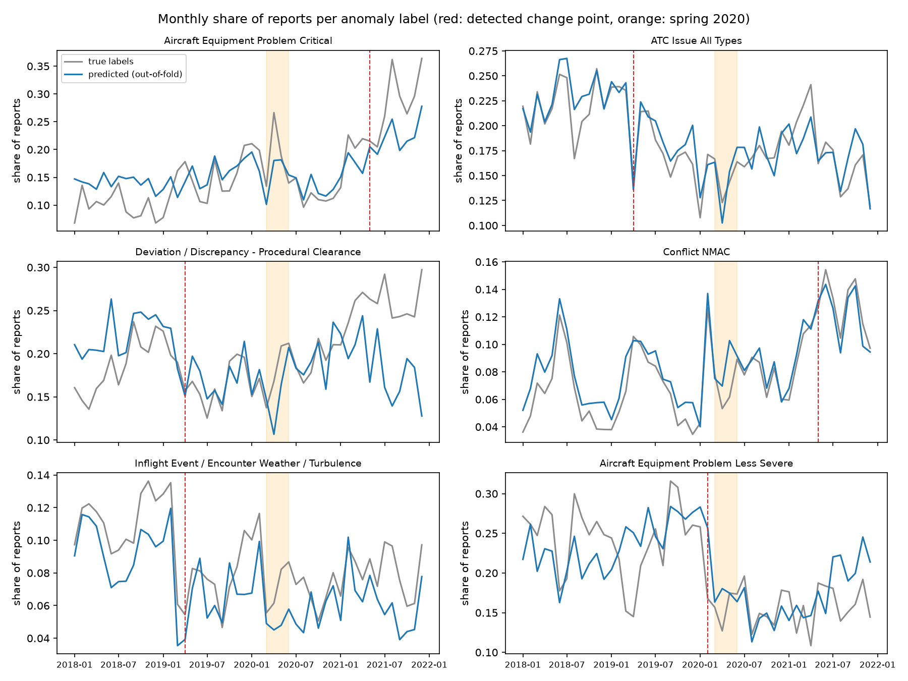
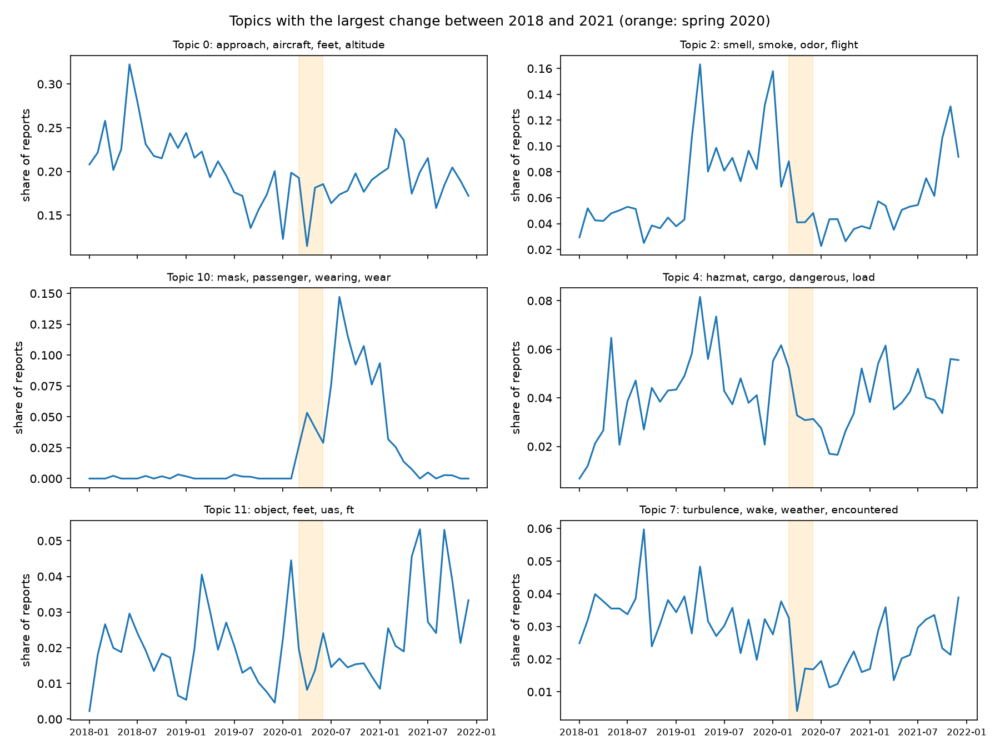
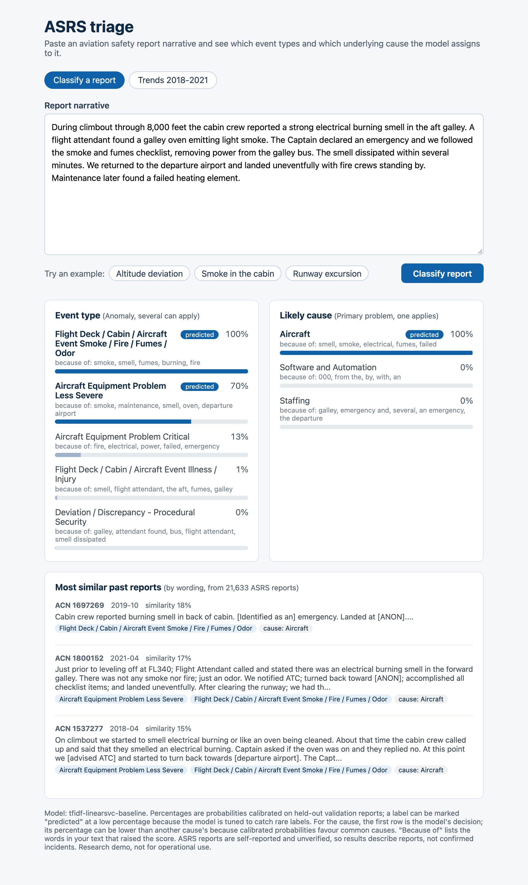
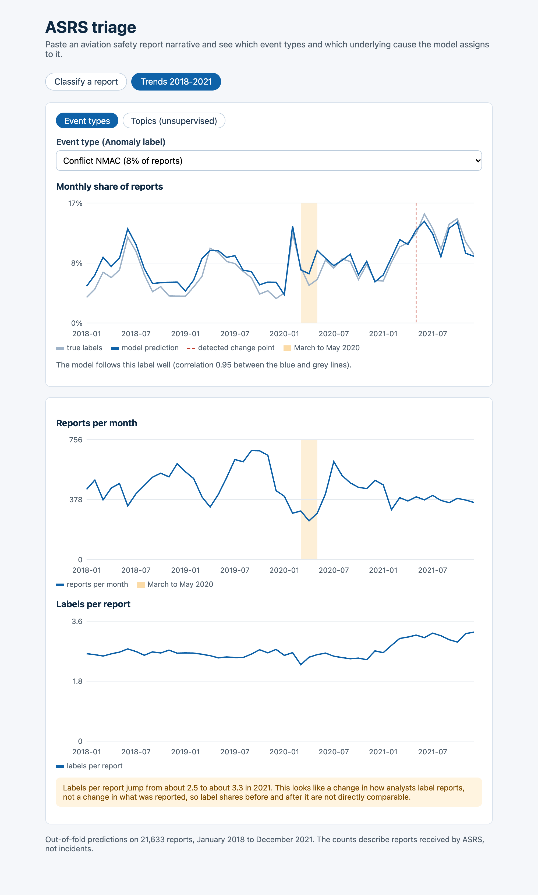
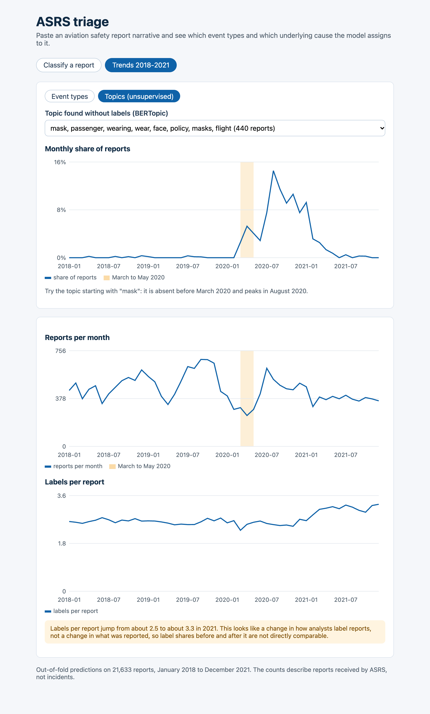

# ASRS triage: automated classification and trend analysis of aviation safety reports

Proof of concept for a master's thesis. Repository: `asrs-triage`.

## 1. What the project does

NASA's Aviation Safety Reporting System (ASRS) collects voluntary reports from pilots, controllers, mechanics and cabin crew. Each report has a free-text narrative, and ASRS analysts assign labels to it by hand. This project:

1. **Classifies** a narrative automatically, predicting the analysts' **Anomaly** labels (several can apply, 53 labels) and the **Primary Problem** (one cause out of 18).
2. **Compares** a simple statistical baseline (TF-IDF with a linear SVM) with a fine-tuned transformer (DeBERTa-v3 with LoRA) under identical evaluation.
3. **Analyses trends** over 2018-2021: how often each label and each automatically found topic appears month by month, and where the frequency shifts.
4. **Serves** the baseline in a local web demo (FastAPI back end, Angular front end).

All statements describe **reports received by ASRS**, not incidents that happened. ASRS is voluntary and unverified, so frequency changes can reflect reporting behaviour.

## 2. Data

- Source: ASRS Database Online CSV exports. The portal caps an export at 5,000 records, so data was exported in half-year slices and combined (`scripts/load_raw.py`).
- Size after cleaning: **21,633 reports, January 2018 to December 2021** (about 450 per month).
- Input to the models: the narrative text only (both reporter narratives concatenated). The analyst-written **Synopsis** and **Callback** fields are never used, because they are written by the same analyst who assigns the labels and would leak the answer.
- Cleaning (`scripts/clean.py`): the placeholder `ZZZ` (de-identified names and places) becomes `[ANON]`; reports without text, labels or date are dropped; months with fewer than 20 reports are dropped.
- **Chronological split** by month (`scripts/split.py`): the first 70% of reports for training (15,178), the next 15% for validation (3,428) and the last 15% for testing (3,027). The model is always tested on reports written after those it trained on, as it would be used in practice. A random split would let it learn from the future.
- Anomaly labels with fewer than 30 training examples are dropped, leaving 53.

## 3. Methods

**Baseline** (`scripts/baseline.py`): TF-IDF features (word 1-2-grams, fitted on the training split only) and a linear SVM with balanced class weights; one-vs-rest for the multi-label Anomaly task.

**Transformer** (`scripts/train_transformer.py`): DeBERTa-v3-base fine-tuned with LoRA (a method that trains small adapter matrices instead of the whole model), one shared encoder with two output heads (Anomaly with a weighted binary loss, Primary Problem with a weighted cross-entropy). Trained on a free Kaggle GPU for 6 epochs; the Anomaly decision threshold is tuned on the validation split.

**Truncation.** The transformer reads at most 512 tokens, and about 24% of test reports are longer. Run 7 kept the first 510 tokens (cutting the end). Run 8 kept the **first 128 and last 382 tokens** ("head+tail"), as the end of a narrative often says what happened.

**Evaluation** (`scripts/evaluate.py`): one shared function for both models. The headline metric is **macro-F1**, which averages the score over labels so that rare labels count as much as common ones; micro-F1, Hamming loss and per-label F1 are also reported.

## 4. Results

Test split, 3,027 reports, chronological:

| Task | Metric | TF-IDF + SVM | DeBERTa-v3 + LoRA (head) | DeBERTa-v3 + LoRA (head+tail) |
|---|---|---|---|---|
| Anomaly | macro-F1 | 0.401 | 0.376 | 0.396 |
| Anomaly | micro-F1 | 0.603 | 0.522 | 0.513 |
| Primary Problem | macro-F1 | 0.305 | 0.296 | 0.343 |
| Primary Problem | micro-F1 | 0.639 | 0.602 | 0.626 |

- **A simple baseline is hard to beat on this data.** The transformer lost clearly with the first truncation (run 7).
- **Head+tail truncation helped** (+0.020 Anomaly macro-F1, +0.047 Primary Problem macro-F1) and now beats the baseline on Primary Problem macro-F1, roughly ties on Anomaly macro-F1, and still trails on micro-F1. These are single runs with one seed; differences under about 0.02 are not established.
- At a fixed threshold of 0.5 the head+tail model reaches 0.425 Anomaly macro-F1 on test. This is reported for transparency but not used as the headline, because the threshold was not chosen in advance (the validation-tuned value gives 0.396).
- **More data helped a lot:** on 2019 alone the transformer's Primary Problem macro-F1 was 0.216; with 2018-2021 it is 0.296 (head) and 0.343 (head+tail).

**Error analysis** (`results/error_analysis.md`, run 7): getting every label of a report exactly right happens for 7.5% (transformer) and 12.4% (baseline) of test reports; the transformer predicts fewer labels per report than analysts assign (2.6 against 3.1); accuracy falls as reports get longer; the main cause confusion is Procedure against Human Factors. Many sampled errors look like analyst label choice (for example generic labels such as "Published Material / Policy" added to otherwise clear reports), not model failure.

**Calibration** (`results/calibration.json`): raw SVM scores are not probabilities. Platt scaling fitted on the validation split brings the expected calibration error on the test split from 0.22 to 0.016 for Anomaly and from 0.50 to 0.019 for Primary Problem.

## 5. Trend analysis

Each report was scored by a model that had not seen it (5-fold cross-validation), then counted per month by predicted label and, for comparison, by true label. Change points were found with PELT; topics with BERTopic (sentence embeddings, UMAP, HDBSCAN, 25 topics, no labels used).



- **Predictions follow the true monthly trends well for specific labels** (correlation 0.89-0.99 for ATC Issue, CFTT/CFIT, NMAC, Smoke/Fire) **and poorly for generic ones** (Clearance 0.21, FAR 0.42), where analysts label inconsistently. Trend claims are limited to the first group.
- **COVID-19 is visible.** Report volume falls to 244 in April 2020 and rises to 617 in July 2020. An unsupervised topic about masks (`mask, passenger, wearing, face, policy`) is absent before February 2020 and peaks at 14.7% of reports in August 2020. No ASRS label captures this theme.
- **A change in analyst labelling is visible.** Labels per report rise from about 2.5 to about 3.3 from early 2021, driven by FAR, Published Material, Clearance and Equipment Problem Critical. This probably reflects analyst practice, not what was reported, so label shares before and after are not directly comparable. No documentation of it was found; it is a hypothesis.
- Several step changes (ATC Issue and Weather in April 2019, Equipment Less Severe in February 2020, NMAC in May 2021) have no cause I could identify.



## 6. The demo



Paste a report (or use an example button) and the app shows:

- the most likely **event types** and the **cause**, as calibrated probabilities;
- **"because of"**: the words in the text that raised each score (from the linear model's weights);
- the **three most similar past reports** from the 21,633, with their labels.

A **Trends** page shows any label's monthly share (analyst labels next to the model's predictions, detected change points, the COVID period shaded), the unsupervised topics, report volume and labels per report.





Notes: the cause shown first is the model's own decision, which can have a lower percentage than another cause because calibrated probabilities favour common classes (using them for the decision would lower cause macro-F1 from 0.305 to 0.266). The demo serves the baseline, which is fast and runs without a GPU.

## 7. How it is built

| Part | Technology |
|---|---|
| Data and baseline | Python 3.12, pandas, scikit-learn |
| Transformer | PyTorch, Hugging Face Transformers, PEFT (LoRA), trained on a Kaggle GPU |
| Trends and topics | ruptures (change points), BERTopic, sentence-transformers |
| API | FastAPI (`/predict`, `/trends/labels`, `/trends/topics`) |
| Front end | Angular 22, standalone components, signals, hand-written SVG charts |
| Tests | Vitest (5 front-end tests) |

Repository layout and run instructions are in `README.md`. In short:

```bash
pip install -r requirements.txt
python scripts/load_raw.py && python scripts/clean.py && python scripts/split.py
python scripts/baseline.py
python scripts/trends.py && python scripts/topics.py
python scripts/export_baseline.py
./run_demo.sh        # API on :8000, app on :4200
```

The development process was recorded in Git with Conventional Commit messages. The design decisions (chronological split, excluding Synopsis, the comparison protocol) and the interpretation of results are described above.

## 8. Limitations

- Only four years and about 21.6k reports (the plan targeted 30k or more); four years cannot separate seasonality from trend.
- Single training runs, one seed; only one ablation (truncation) so far.
- The cross-validated trend predictions mix years in training, so they understate how badly a model trained on the past would track future drift.
- The labelling shift in 2021 limits comparisons of label shares across it.
- The demo's calibration is fitted on one split of one period.

## 9. Next steps

- Improve the transformer: further ablations (maximum length, learning rate, class weighting), a long-context model, several seeds.
- More data (2022 onwards) to reach the planned size and test whether the labelling shift continues.
- Possible extension if time allows: transcribing air traffic control speech and classifying the transcripts with the trained model.
